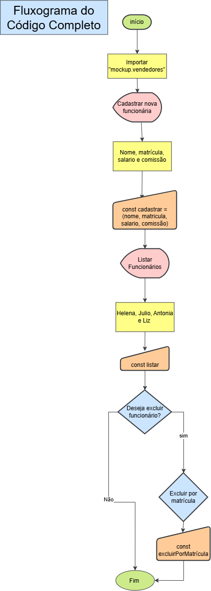
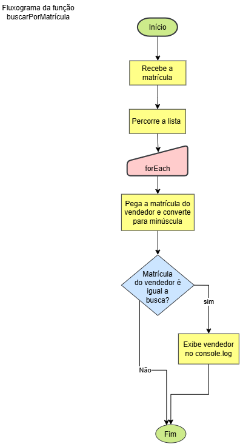

# Atividade Back end

Nesse repositório está os códigos completos e o fluxograma de cada código pedido!!

## Código Completo

```
let vendedores = require("./mockup.vendedores");

const cadastrar = (nome, matricula, salario, comissao) => {
    let vendedor = {
        nome,
        matricula,
        salario,
        comissao
    };
    vendedores.push(vendedor);
};

const listar = () => {
    vendedores.forEach((vendedor) => {
        console.log(vendedor);
    });
};

const buscar = (busca) => {
    vendedores.forEach( (vendedor) => {
        let temp = JSON.stringify(vendedor).toLowerCase();
        if(temp.includes(busca.toLowerCase())) {
            console.log(vendedor);
        }
    } );
};

const buscarPorMatricula = (busca) => {
    vendedores.forEach( (vendedor) => {
        let matricula = vendedor.matricula.toLowerCase();

        if(matricula == busca.toLowerCase()) {
            console.log(vendedor);
        }
    } );
};

const buscarPorNome = (busca) => {
    vendedores.forEach( (vendedor) => {
        let nome = vendedor.nome.toLowerCase();

        if(nome == busca.toLowerCase()) {
            console.log(vendedor);
        }
    } );
};

const excluirPorMatricula = (matricula) => {
    vendedores.forEach((vendedor, indice) => {
        let matriculaTemp = vendedor.matricula.toLowerCase();

        if(matriculaTemp == matricula.toLowerCase()) {
            vendedores.splice(indice, 1);
        }
    });
};
`
cadastrar("Liz", "19348", 1850, 0.15);
excluirPorMatricula("13944");
buscarPorMatricula("12039");
buscarPorNome("Helena")
listar();
```
# Código `excluirPorMatrícula 

```
const excluirPorMatricula = (matricula) => {
    vendedores.forEach((vendedor, indice) => {
        let matriculaTemp = vendedor.matricula.toLowerCase();

        if(matriculaTemp == matricula.toLowerCase()) {
            vendedores.splice(indice, 1);
        }
    });
};
```

# Código buscarPorMatrícula

```
const buscarPorMatricula = (busca) => {
    vendedores.forEach( (vendedor) => {
        let matricula = vendedor.matricula.toLowerCase();

        if(matricula == busca.toLowerCase()) {
            console.log(vendedor);
        }
    } );
};
```
# Código buscarPorNome

```
const buscarPorNome = (busca) => {
    vendedores.forEach( (vendedor) => {
        let nome = vendedor.nome.toLowerCase();

        if(nome == busca.toLowerCase()) {
            console.log(vendedor);
        }
    } );
};
```




